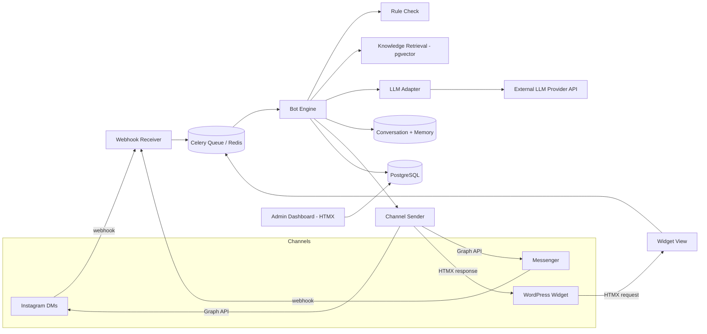

# Architecture — AI Customer Support Chatbot

## 1. Tech stack

| Layer | Choice | Why |
|---|---|---|
| Backend framework | Django | Batteries-included, fast to build admin-heavy apps |
| Frontend interactivity | HTMX (+ a sprinkle of Alpine.js for pure client-side bits like modals) | No separate SPA/build step; server renders HTML fragments |
| Styling | Tailwind CSS | Fast to theme, works cleanly with server-rendered templates |
| Database | PostgreSQL + `pgvector` extension | Relational data + vector similarity search in one database, no separate vector DB service needed at this scale |
| Async tasks | Celery + Redis | Webhook handlers must return fast; LLM calls, embedding generation, and memory summarization run in the background |
| Containerization | Docker + Docker Compose | Matches existing VPS deployment pattern; portable |
| LLM access | Direct HTTP calls to provider APIs (OpenAI-compatible or Anthropic-native), no LangChain/heavy framework required | Keeps the provider-swap logic simple and fully under our control |
| Embeddings | `sentence-transformers` (local, e.g. `all-MiniLM-L6-v2`, 384-dim) by default; swappable for a hosted embedding API later | Free, no extra API dependency, good enough for FAQ-style retrieval |

## 2. System overview



## 3. Django app breakdown

Keep each app narrowly scoped — this maps close to 1:1 with `03_DATABASE_SCHEMA.md`.

- **`platforms/`** — `Channel` model (Instagram/Messenger/WordPress connections + credentials). Named `platforms`, not `channels`, to avoid confusion with the unrelated Django Channels (websockets) library.
- **`llm/`** — `LLMConfig` model, the provider adapter classes, and the prompt-building logic.
- **`knowledge/`** — `KnowledgeChunk` and `Rule` models, embedding generation, retrieval logic.
- **`conversations/`** — `Customer`, `Conversation`, `Message` models. This is the shared "memory" store.
- **`bot/`** — the orchestration layer: given an inbound message, runs rules → retrieval → LLM call → saves reply. This is the "brain" that ties the other apps together. Exposed as a Celery task, not a view.
- **`webhooks/`** — Instagram/Messenger webhook receiver views (thin — verify, parse, enqueue, return 200 fast).
- **`widget/`** — serves the embeddable JS snippet and the iframe chat page for WordPress; talks to `bot/` the same way the webhook app does.
- **`dashboard/`** — the internal HTMX-driven admin UI: CRUD for `LLMConfig`, `KnowledgeChunk`, `Rule`, `Channel`, plus conversation review screens.
- **`accounts/`** — staff auth (Django's built-in auth is enough for v1) and a stub `Agent` model for future handoff.
- **`core/`** — settings, root urls, shared utilities (encryption helpers, etc.).

## 4. Data flow per channel

### Instagram / Messenger
1. Meta sends a POST to a shared `/webhooks/meta/` endpoint.
2. View verifies the `X-Hub-Signature-256` header against the app secret, parses the payload to identify channel type (IG vs Messenger) and sender ID, and immediately returns `200 OK`.
3. The actual work — find/create `Customer` + `Conversation`, save the inbound `Message`, run the bot engine, send the reply — happens in a Celery task so Meta's webhook never times out waiting on an LLM call.
4. The reply is sent back via the relevant Graph API endpoint using that channel's stored page access token.

### WordPress widget
1. Small embed script (served by `widget/`) injects a floating button + hidden iframe into the customer's WordPress page. The iframe `src` points at our own domain (`/widget/chat/?site_key=...`), so everything inside the iframe is same-origin with our backend — no CORS complexity for the chat itself.
2. Customer types a message → HTMX POST to `/widget/chat/<session_id>/send/` → server runs the bot engine **synchronously enough to return an HTML fragment** (small/fast enough not to need the Celery round-trip the way webhooks do, since there's no external retry policy to worry about — though it can still enqueue background work like memory summarization).
3. Server returns an HTML fragment (new message bubbles) which HTMX swaps into the chat log.

## 5. LLM adapter design

Two adapter implementations cover effectively every provider worth using for a "cheap models" strategy:

```python
class LLMAdapter:
    def send(self, messages: list[dict], config: "LLMConfig") -> str:
        raise NotImplementedError

class OpenAICompatibleAdapter(LLMAdapter):
    """Works for OpenAI, DeepSeek, Groq, OpenRouter, Together.ai,
    local Ollama, and anything else exposing a /chat/completions
    endpoint in the OpenAI request/response shape."""
    def send(self, messages, config):
        resp = requests.post(
            f"{config.api_base_url}/chat/completions",
            headers={"Authorization": f"Bearer {config.api_key}"},
            json={
                "model": config.model_name,
                "messages": messages,
                "temperature": config.temperature,
                "max_tokens": config.max_tokens,
            },
            timeout=30,
        )
        resp.raise_for_status()
        return resp.json()["choices"][0]["message"]["content"]

class AnthropicAdapter(LLMAdapter):
    def send(self, messages, config):
        resp = requests.post(
            "https://api.anthropic.com/v1/messages",
            headers={
                "x-api-key": config.api_key,
                "anthropic-version": "2023-06-01",
                "content-type": "application/json",
            },
            json={
                "model": config.model_name,
                "max_tokens": config.max_tokens,
                "messages": messages,
            },
            timeout=30,
        )
        resp.raise_for_status()
        return resp.json()["content"][0]["text"]
```

A small factory picks the adapter based on `LLMConfig.provider`. Adding a new *OpenAI-compatible* provider later never requires new code — just a new `LLMConfig` row with a different `api_base_url`.

## 6. Memory & RAG design

- **Short-term memory:** last N messages (configurable, default ~10) for the current `Conversation`, pulled straight from the `Message` table and formatted as the chat history sent to the LLM.
- **Long-term memory:** `Customer.memory_summary` — a plain-text summary regenerated by a Celery task every time a conversation crosses a message-count threshold (e.g. every 20 messages) or goes idle. The task asks the LLM to summarize "durable facts worth remembering about this customer" from the recent transcript and overwrites the field. This keeps the prompt small instead of ever-growing.
- **RAG:** on save, a `KnowledgeChunk`'s `content` is embedded (Celery task, so admin edits don't block on embedding latency) and stored in a `pgvector` column. At query time, the bot engine embeds the incoming message and does a similarity search (`<=>` cosine distance operator) to pull the top-k relevant chunks, which get folded into the system/context portion of the prompt.
- **Rules vs RAG:** rules are checked first and are deterministic (keyword match → fixed or templated response, optionally short-circuiting the LLM entirely). RAG results are *context*, not a hard override — the LLM still composes the final reply using them.

## 7. Security considerations

- **Credential encryption:** `LLMConfig.api_key` and `Channel.credentials` (which holds page access tokens, app secrets, etc.) must be encrypted at rest — use `django-cryptography` (or `cryptography`'s Fernet directly) with a key sourced from an environment variable, never committed.
- **Webhook verification:** every inbound Meta webhook POST must be validated against `X-Hub-Signature-256` using the relevant app secret before any processing. Reject anything that fails verification.
- **Iframe embedding / clickjacking:** the WordPress widget page is deliberately loaded in an iframe, which conflicts with Django's default `X-Frame-Options: DENY`. Don't disable this globally — instead, set `Content-Security-Policy: frame-ancestors <allowed_domain>` dynamically per request, looking up the allowed domain from the `Channel.credentials` matching the `site_key` in the request. This scopes embedding permission to only the customer's actual WordPress domain.
- **Dashboard auth:** staff-only, behind Django's normal login + `@staff_member_required` (or a custom decorator) — this is an internal tool, not customer-facing.
- **Secrets never echoed back:** once an API key or access token is saved, the dashboard should display it masked (e.g. `sk-••••1234`) and only accept a new value on edit, never round-trip the real value into a form field.

## 8. Deployment shape

Single `docker-compose.yml` with services for `web` (Django via Gunicorn), `worker` (Celery), `beat` (Celery beat, for the periodic memory-summarization/cleanup tasks), `db` (Postgres with the `pgvector` extension enabled), and `redis`. No bundled reverse proxy is assumed — the `web` service exposes a plain HTTP port for whatever's already handling TLS/routing in front of it (e.g. a Dokploy-managed reverse proxy or a Cloudflare Tunnel), matching how other services are already deployed. See `05_BUILD_PLAN.md` for the actual compose file.
